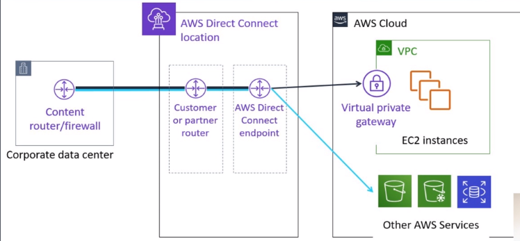

# AWS Direct Conect

Uma conexão de rede dedicada para ligar serviços de infraestrutura local com a infraestrutura AWS.

Para montar infraestrutura híbrida com conexão dedicada um ponto de presença físico da AWS possui dois roteadores interligados um para ligar a rede local do usuário e outro ligando com a infraestrutura AWS.

