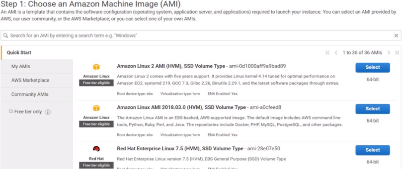

# ec2 - elastic computed cloud

## Benefícios

- elasticidade: acompanhar a demanda do usuário

- controle total: parar, reiniciar, excluir, hibernar

- flexibilidade: escolher instância adequada conforme aplicação

- integração: integração com outros serviços da AWS

- confiável: garantia de 99% de disponibilidade

- segurança: firewall de rede, firewall de software

- baixo custo: instância sob demanda, instância reservada(economia de até 75%)

- fácil: rapidamente é possível provisionar recursos.

## Escolher instância certa

Aplicação utiliza preferencialmente:

- memória
- cpu
- rede
- armazenamento

### Exemplo Famílias

- C: são otimizadas para computação (C4, C5 ...)
- M: são instâncias de uso genérico (M4, M5 ...)

### Escolher AMI (Amazon Machine Image)

Disponíveis imagens de sistemas operacionais para utilização nas aplicações.

Disponíveis nativamente, padrão ou com alguns recursos extras:

- Windows 10
- Red Hat
- Ubuntu
- Amazon Linux (Red Hat)

Outros sistemas operacionais e personalizações podem ser obtidos na AWS Marketplace.

Instâncias do tipo `free tier` são gratuitas enquanto sua conta estiver na categoria de bonificação (12 primeiros meses)

### Auto Scaling

Útil para ajustar a capacidade da aplicação conforme necessidade.

Escalabilidade horizontal dinâmica, configura-se o mínimo e o máximo de instâncias associadas a uma aplicação além do valor padrão.

### Elastic Load Balancing

Balanceador de cargas, funciona como um proxy antes da requisição chegar até as aplicações.

- Alta disponibilidade
- Verificar saúde
- SSL/TLS terminação, retira da instância o custo dessa operação
  
#### Aplication Load Balancer

Utilizando a camada 7 (aplicação) do modelo OSI, faz o gerenciamento baseado no path das requisições.

#### Network Load Balancer

Utilizando a camada 4 (transporte) do modelo OSI, faz o gerenciamento baseado no IP e na porta das requisições.

### Precificação

- Instâncias On-demand: pagamento por horas de uso
- Instâncias reservadas: pagamento antecipado com descontos
- Dedicated Hosts: servidor físico dedicado, útil caso seja requisito de compliance da aplicação
- Spot instances: adquirir recursos computacionais temporários que estão sobrando em outros clientes pagando um preço baixo
