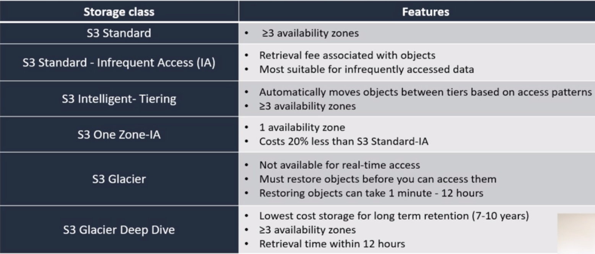

# s3-Simple Store Service

- armazenamento em objeto

- armazenamento ilimitado (5TB por objeto)

- durabilidade de 99%, garantia de que o objeto foi armazenado

- acesso granular por bucket ou por objeto

- rápido, durável, alta disponibilidade e acesso aos objetos é baseado em chaves

- não é um sistema de arquivos, não deve ser utilizado como banco de dados

- ideal para poucas gravações e muitas leituras

## Utilidades

- backup e armazenamento

- hospedagem de aplicações

- hospedagem de mídias

- entrega de softwares

## Recursos

- pagamentos por cada requisição

- versionamento de objetos (não é git)

- hospedar sites estáticos

- gerenciamento do ciclo de vida de objetos em diferentes classes de armazenamento

## Classes de armazenamento de objetos

Quanto menor o SLA menor o valor pago pelo armazenamento mas maior pela requisição.

### S3 Glacier

- arquivamento de arquivos de baixo custo backup de longo prazo

- configuração do ciclo de vida dos conteúdos do Glacier, pode-se configurar a exclusão automática de dados.

- recuperação dos dados podem ser feitas em 3 modalidades:
  - Standard: 3-5 horas
  - Bulk: 5-12 horas
  - Expedited: 1-5 minutos

Vault lock policy

- política de controle individual de objetos, pode ser configurado uma regra imutável para um objeto. Por exemplo, impedir a exclusão intencional ou não de um objeto por um determinado tempo, ou que ele seja alterado.
