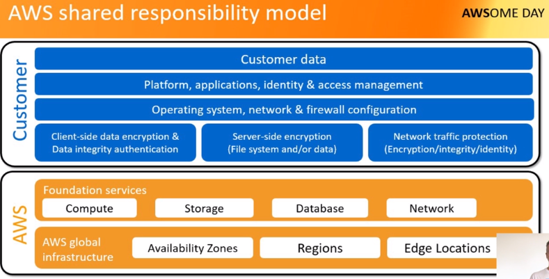
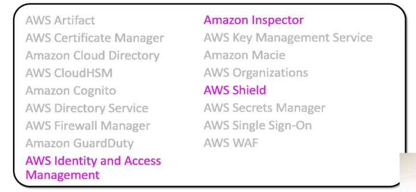

# Security

Modelo de responsalibidade compartilhada

AWS oferece segurança na nuvem de serviços e infraestrutura global

O cliente fica responsável pela segurança da sua aplicação.

Há vários serviços para garantir a maior segurança aos clientes.

